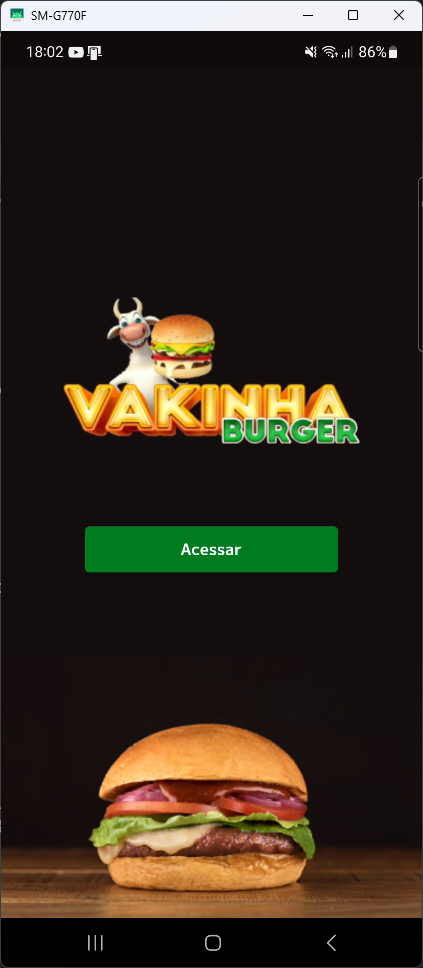
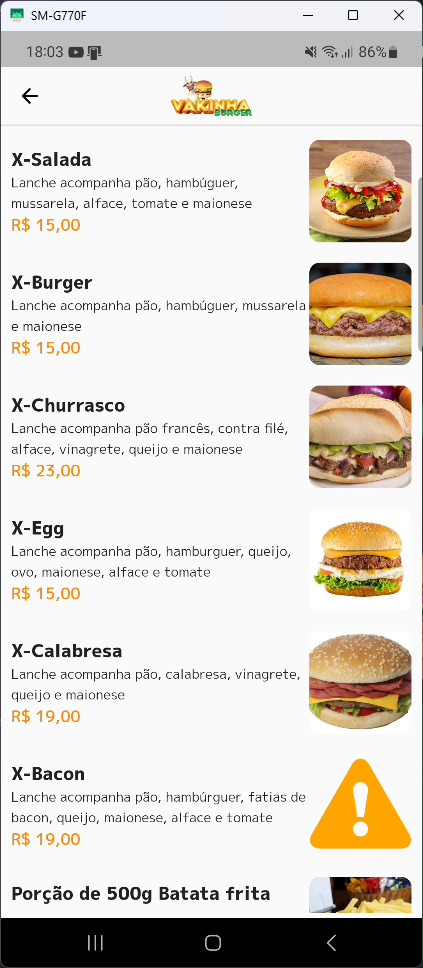
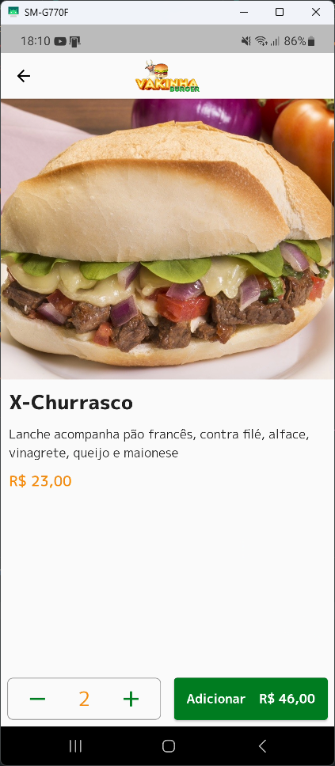
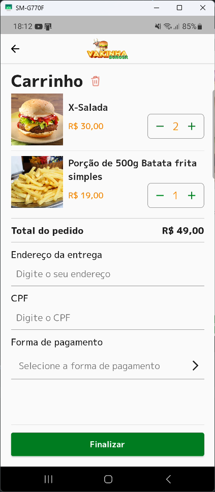
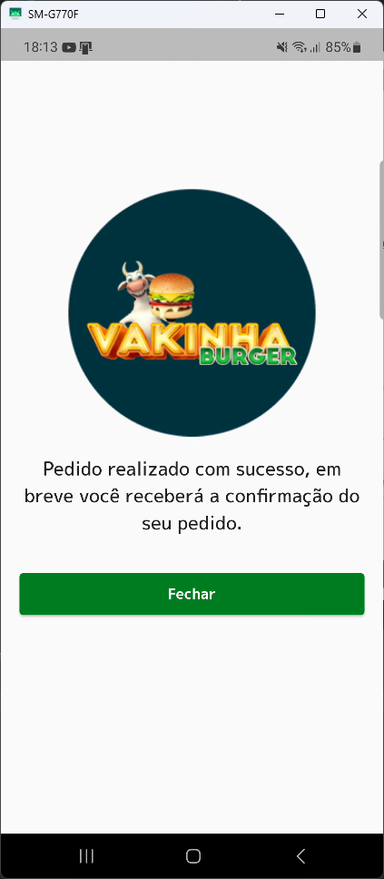
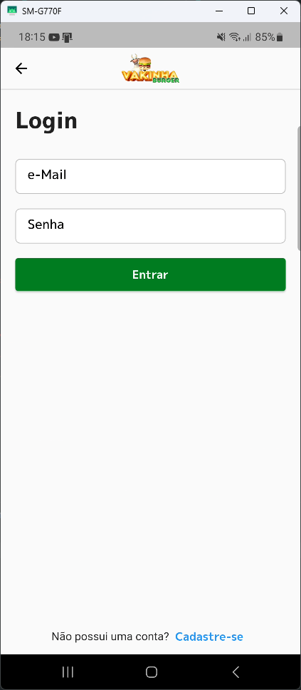
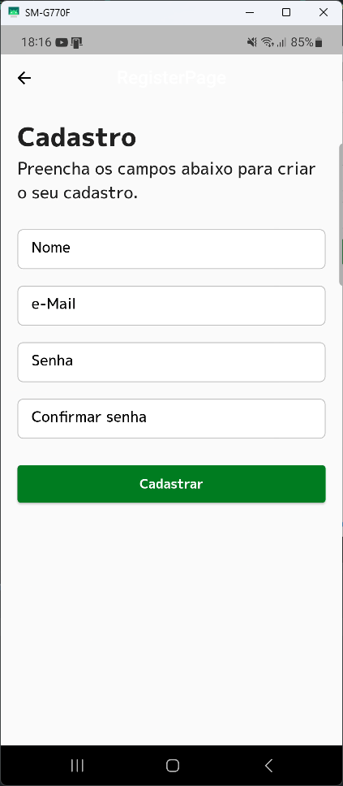

# Delivery App

Bem-vindo ao repositório do Delivery App! Este é um projeto desenvolvido durante a Dart Week, um evento promovido pela Academia do Flutter com o instrutor Rodrigo Rahman. O Delivery App é um aplicativo para celular construído com o Flutter e tem como objetivo ajudar os clientes a realizarem seus pedidos de lanches diretamente no aplicativo.

## Funcionalidades
O Delivery App oferece as seguintes telas:

Home: Com todos os lanches disponíveis para que o cliente faça seu pedido.

Detalhe: Exibe um produto detalhadamente, permitindo informar a quantidade desejada e adicionar o produto ao carrinho de compras.

Carrinho de Compras: Exibe todos os produtos que foram adicionados ao carrinho e permite alterar a sua quantidade, excluir um item do carrinho, limpar o carrinho e confirmar o seu pedido.

Login: Permite que um usuário já registrado possa realizar sua autenticação no aplicativo.

Registro: Permite que um novo usuário possa realizar seu cadastro no sistema.

## Imagens das Telas

A seguir, você pode conferir algumas capturas de tela do aplicativo:

### Página Inicial


### Página Home


### Página de Detalhe do Produto


### Página de Visualização do Carrinho de Compras


### Página de Pedido Realizado


### Página de Login do Usuário


### Página de Cadastro de Novo Usuário


## Pré-Requisitos

O Delivery App é uma aplicação web que precisa que o back-end esteja online para que possa ser executado corretamente. No curso foi utilizada uma **API Rest** via [Json Rest Server](https://pub.dev/packages/json_rest_server) e para utilizá-la deve-se seguir estes passos:

Instalar o Json Rest Server:

```sh
dart pub global activate json_rest_server
```

Clonar o repositório da API:

```sh
git clone https://github.com/rodrigorahman/dw10_delivery_api.git
```

Navegue até o diretório clonado:

```sh
cd dw10_delivery_api
```

Executar a api através do comando:

```sh
json_rest_server run
```

## Instalação do Delivery App

Siga as instruções abaixo para configurar e executar o projeto em seu ambiente local:

Certifique-se de ter o Flutter instalado em sua máquina. Para obter as instruções de instalação, visite a documentação oficial do Flutter. A versão do Flutter utilizada neste projeto é a 3.10.6.

Clone este repositório para o seu computador utilizando o seguinte comando:

```sh
git clone https://github.com/ricardoemerson/delivery_app_bloc.git
```

Navegue até o diretório clonado:

```sh
cd delivery_app_bloc
```

Execute o seguinte comando para obter as dependências do projeto:

```sh
flutter pub get
```

Agora você está pronto para executar o aplicativo em seu ambiente local. Utilize o comando:

```sh
flutter run
```

Isso abrirá o aplicativo Delivery App em seu navegador.

## FVM

Se você estiver com o FVM instalado em sua máquina basta proceder conforme abaixo:

Navegue até o diretório clonado:

```sh
cd delivery_app_bloc
```

Instale a versão do Flutter utilizada no projeto:

```sh
fvm install
```

Execute o seguinte comando para obter as dependências do projeto:

```sh
fvm flutter pub get
```

Agora você está pronto para executar o aplicativo em seu ambiente local. Utilize o comando:

```sh
fvm flutter run
```

## Contribuição
Contribuições são bem-vindas! Se você tiver sugestões, correções de bugs ou melhorias para o projeto, sinta-se à vontade para abrir uma issue ou enviar um pull request.

Antes de enviar um pull request, certifique-se de que seu código está alinhado com as boas práticas de desenvolvimento e que seja compatível com o projeto.

## Licença
Este projeto está licenciado sob a Licença MIT. Consulte o arquivo LICENSE para obter mais informações.
